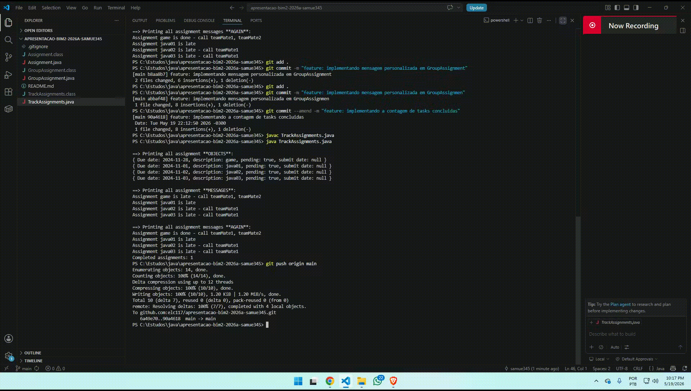
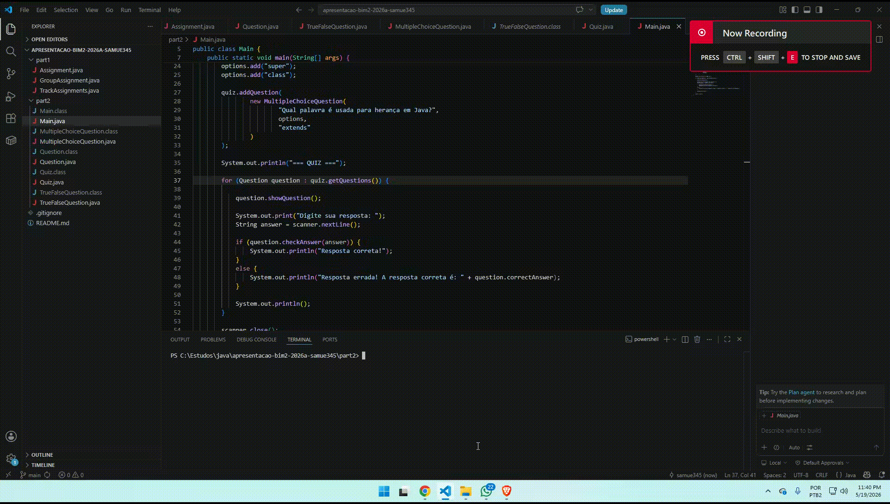

# Apresentação
Eu já tinha o java instalado na minha maquina, então basicamente só compilei o arquivos.
## Parte 1
  

  A parte 1 foi bem tranquila, eu só precisei usar as fontes que estavam no site da disciplina para conseguir fazer. Enquanto estava implementando os métodos, encontrei um possível erro nesse método:
  ```
  public int daysLeft() {
    return dueDate.compareTo(LocalDate.now());
  }
  ```
  Acredito que esse método deveria calcular o número de dias até o vencimento da tarefa, porém o compareTo não calcula a diferença entre as datas. Eu modifiquei as datas afim de teste e vi que os valores não batiam. Coloquei o due date para 2026-11-01 e comparei com a data 2026-05-20 e o resultado deu 6, porque fez a subtraçao de 11 - 05.
## Parte 2


### Classes criadas
Quiz.java


Question.java


MultipleChoiceQuestion.java


TrueFalseQuestion.java


Também fo criada a classe main, porém ela é muito grande então vou colocar só um trecho


# Fontes
* https://www.youtube.com/watch?v=Wgkb0zg7WOM&t=1s
* http://www.mauda.com.br/?p=1472
* https://www.w3schools.com/java/ref_keyword_super.asp
* https://materialpublic.imd.ufrn.br/curso/disciplina/2/8/8/4
* https://www.devmedia.com.br/uso-de-polimorfismo-em-java/26140
* https://medium.com/@AlexanderObregon/how-javas-super-keyword-works-in-method-calls-and-constructors-2365efdc0f80
